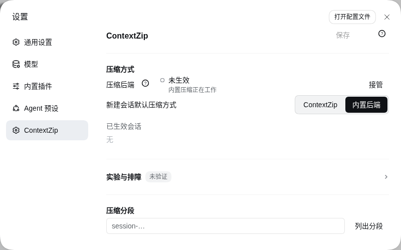
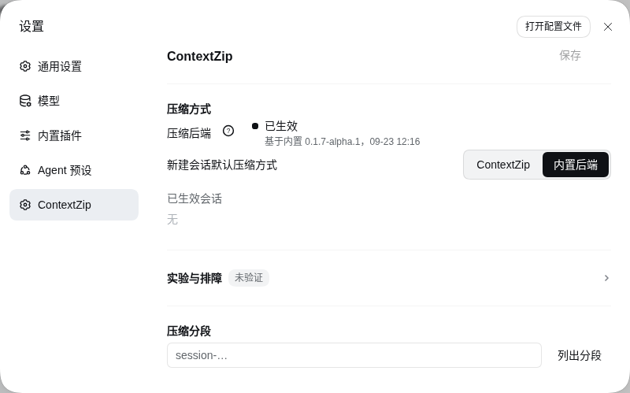
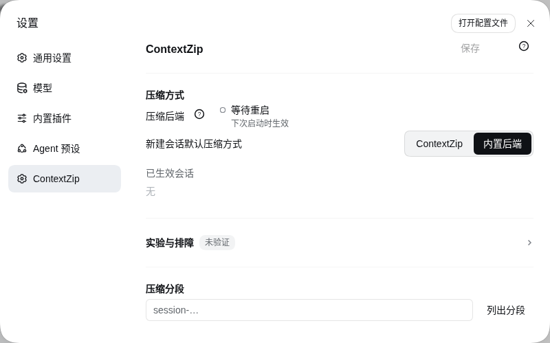
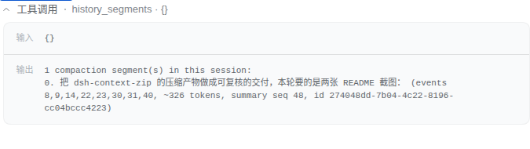
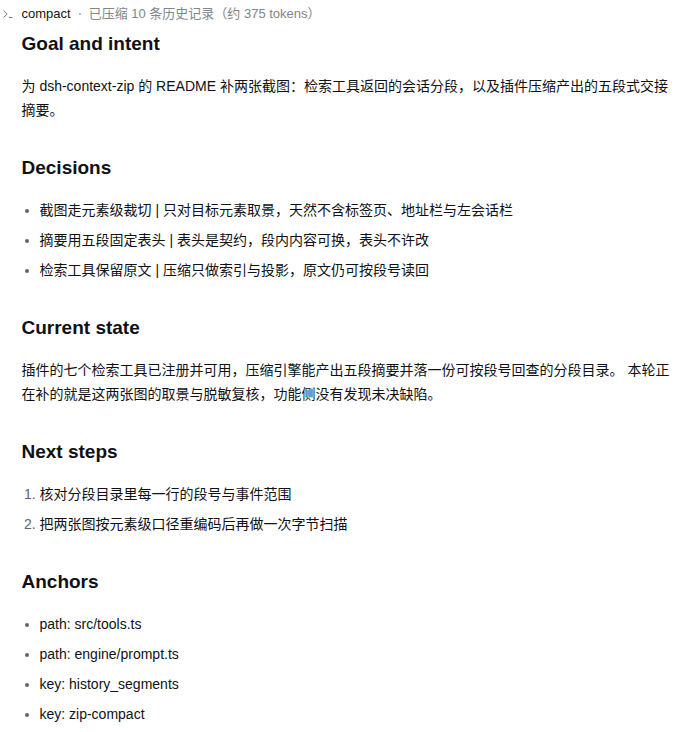

# dsh-context-zip

[](https://www.npmjs.com/package/dsh-context-zip)
[](https://www.npmjs.com/package/dsh-context-zip)
[](./LICENSE)
[](https://github.com/brunhildzhou/dsh-context-zip)

**给 DeepSeek Harness（DSH）用的上下文压缩插件：接管宿主自带的压缩摘要器，改成固定五段式交接摘要，被压掉的原文进分段目录、可回查。** 版本 `0.1.5`，MIT 许可。见 [npm 上的 dsh-context-zip](https://www.npmjs.com/package/dsh-context-zip)。[English](./README.en.md)

## 能力一览

- **五段式交接摘要**：压缩那一步改走本插件，摘要按 `Goal and intent`、`Decisions`、`Current state`、`Next steps`、`Anchors` 五段产出。
- **原文可回查**：每次压缩记一段，段号、被替换的事件号、摘要事件号都能列出来，原文按段号或事件号读回。
- **检索工具与导出**：`history_segments`、`history_read`、`history_search`、`history_find` 只读本会话历史，另有只读服务与 `/zip-export` 导出。
- **可选能力**：模型工作笔记、机械摘要兜底、散文摘要排版重排，默认都是关的；一个设置面板控制以上全部。

## 安装与升级

两条路，任选一条。

**路 A：从 npm 装。** 装完能启动、面板能打开，但压缩不生效（缺行重定向）。补法：设置面板 ContextZip 一节里，点「压缩后端」那一行右端的「接管」，然后重启 harness 一次。

```bash
dsh plugin --profile web add dsh-context-zip
```

升级把版本换掉再跑一次：

```bash
dsh plugin --profile web add dsh-context-zip@<版本>
```

实测事实：pnpm 不会清掉重定向，所以接管只需做一次，之后升级不用重新接管。

**路 B：从源码检出装。** 一步装好本体与重定向。profile 至少启动过一次，再跑：

```bash
node install.mjs --profile-dir <profile 目录>
```

例如 `node install.mjs --profile-dir <harness home>/profiles/web`。完整参数、卸载与回滚见 `docs/安装与卸载.md`。

## 它接管的是哪一步

DSH 在上下文接近窗口上限时自动压缩会话。默认实现让模型自由写一段摘要，原文之后难找。本插件把这一行替换掉：

```
自动压缩触发
  │
  ├─ 未接管：内置后端写自由摘要，原文难回查
  │
  └─ 已接管：本插件写五段交接摘要
        ├─ 摘要落盘（压缩后唯一的权威）
        └─ 原文进分段目录（按段号 / 事件号回查）
```

接管是逐行替换，不是并行挂载。插件不修改 DSH 自身代码，不往会话日志写任何事件。

## 能力表格

| 能力 | 说明 | 默认状态 |
|---|---|---|
| 压缩接管 | 五段式交接摘要，软目标 3072 token，硬上限 6144 | 关（新建会话走内置后端，面板里可开） |
| 分段目录 | 每次压缩记一段，可列出段号、被替换事件号、摘要事件号 | 常开 |
| 检索工具 | `history_segments`、`history_read`、`history_search`、`history_find`，只读本会话 | 常开 |
| 工作笔记 | `notes_write` / `notes_read` / `notes_search`，草稿上限 6000 字符，下一次压缩时并入摘要 | 关 |
| 机械摘要兜底 | 连续失败到设定次数（默认 5）后用台账摘要使压缩落地 | 关 |
| 排版重排 | 无小标题结构的摘要追加一次只改排版的调用，不重发原文 | 关 |
| 检索节流 | 检索回执、增量过滤、收窄与读取上限；效果从未确立 | 关 |
| 设置面板 | ContextZip 一节：压缩方式、摘要兜底、摘要重排、实验与排障、压缩分段；输入框旁有压缩方式芯片 | 常开 |
| 导出与手动压缩 | 只读服务 `contextZip` 与 `/zip-export` 命令；`/zip-compact` 命令不受总开关管辖 | 常开 |

面板那一行长这样：左标题带问号气泡，中间主行加副行，右端按钮。共九态：未生效、正在接管、已生效、待更新、等待重启、被占用、接管不完整、状态未知、接管失败。其中「被占用」在面板上主行显示「未生效」，副行说明那个位置已被别的实现占着。

## 截图

面板「压缩后端」那一行的四种状态：






检索工具的输出与压缩后的五段式交接摘要：




四态截图取自隐藏虚拟桌面里的一个临时 DSH 实例（临时 `DSH_HOME`、端口 3190），不是用户真机；后两张的会话内容由本地桩模型驱动，用来展示界面形态，不作为能力或效果证据。逐图来源与脱敏口径见 `docs/截图清单.md`。

## 兼容性与边界

- **宿主**：DeepSeek Harness，peer 范围 `>=0.1.5-rc.2 <0.2.0-0 || >=0.1.6-0 <0.2.0-0 || >=0.1.7-alpha.1 <0.2.0-0`；实测通过的是 `0.1.5-rc.2`、`0.1.6-alpha.2` 与 `0.1.7-alpha.1`，其余 0.1.x 版本未逐一实测。
- **Node.js**：`^22.19.0 || >=24.0.0`（`dsh-context-zip/package.json` 的 `engines`）。
- **peer 依赖**由 profile 的 `node_modules` 解析，不随本插件安装。
- **`@deepseek-ai/schemastery`**：peer 下限 `^3.18.1`，取的是已知能跑的最低版本。`Schema.volatile()` 是 3.18.3 才有的 API，低于它的版本上插件照常压缩、照常读写行配置，只是设置页不会生成表单、设置写入走插件面板的配置编辑器；想要那张自动表单，需要 profile 那份 schemastery 升到 3.18.3。
- **界面语言**中英双语，面板文案两套，键集合一致。
- **只支持 DSH**，不能独立运行。
- `redirect/` 是本地重定向包，沿用 `@deepseek-ai/dsh-compaction-basic` 包名把调用接到本插件。它不是官方包（`private: true`），安装器拒绝覆盖真实包。
- 升级 DSH 之后重定向可能落后，用 `--check` 确认并重跑安装刷新。
- 其余边界（节流效果未确立、会话名最长 60 秒更新、标题备忘录无容量上限、按会话覆盖表在面板上只读、安装器不留快照）见 `docs/局限性与已知问题.md`。

## 怎么自己验证

插件自带运行时检查，`--installed` 加 `--deliverable` 一档实测 1358 条全过。跑法与覆盖见 `evidence/套件说明.md`。

## 仓库布局

仓库根是发布包：`README.md` / `README.en.md`、本插件目录 `dsh-context-zip/`、文档 `docs/`、证据 `evidence/`、`RELEASE-NOTES.md`、`LICENSE`。完整导览见 `docs/仓库布局.md`，功能入口见 `docs/`。

## 用着还行的话

欢迎到 [GitHub](https://github.com/brunhildzhou/dsh-context-zip) 点个 star，或者提 issue 说哪里不好用。

## 许可与致谢

MIT，许可全文见 `LICENSE`。运行环境是 [DeepSeek Harness](https://github.com/deepseek-ai/deepseek-harness)。与同类插件的对照（含本插件不如别人的地方）见 `docs/同类插件对比.md`。
